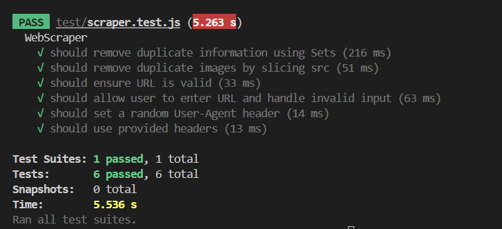

# Test Rapport

The module was tested through the use of automatic testing written with Jest, a JavaScript-framework. In order to test the module mock HTTP-requests were created through node-fetch. Every test verifies the functionality of the functions in the module, such as the removal of duplicate information using Set, illigitimate URLs, and the use of random User-Agents in the request headers.
To see the test code repository please see:
https://github.com/sh224wg/TestL2.git

## Bug Reports / Issues

| Issue ID | Description                                      | Status   | Comments                        |
|----------|--------------------------------------------------|----------|---------------------------------|
| 1        | Invalid URL handling throws incorrect error      | Resolved | Fixed                           |
| 2        | Duplicate images not correctly identified        | Resolved | Fixed                           |
| 3        | User-Agent header not set randomly               | Resolved | Fixed                           |
| 4        | Prompt function does not handle empty input      | Resolved | Fixed                           |
| 5        | Next page function should scrape multiple pages  | Open     | Variation in next page id       |

| Metodnamn        | Testmetod       | Testresultat    |
|------------------|-----------------|-----------------|
| isValid          | Unit Test       | Pass            |
| scrape           | Unit Test       | Pass            |
| getParagraphs    | Unit Test       | Pass            |
| getTitles        |                 |                 |
| getImages        | Unit Test       | Pass            |
| askForUrl        | Unit Test       | Pass            |

## Testresultat
|Metodnamn        | Testmetod               | Testresultat    |
|-----------------|-------------------------|-----------------|
| URL Validation  |Test with invalid URL and| Passed, invalid |
| (isValid)       |scraper is should throw  | URL throws error|
|                 |error.                   |                 |
|-----------------|-------------------------|-----------------|
|Scraping         |Test with URL            | Passed, scrapes |
|Functionality    | & checked the           | content of      | 
|(scrape)         |scraping result.         | website         |
|-----------------|-------------------------|-----------------|
|Handle Duplicate |A test scrapes a website | Passed,         |
|Information      |with repeated 
 & <h>  | duplicates      |
|Using Sets in    |tags, expect duplicate   | removed         | 
|each function    | removal using Set       |                 |
|(getTitles/paragraphs)|                    |                 |
|-----------------|-------------------------|-----------------|
|HandleDuplicate  |Test scrapes website with| Passed,         |
|Images(getImages)|repeated image paths,    | duplicates      | 
|                 |expecting unique images  | identified      |
|                 |after slicing            |                 |
|-----------------|-------------------------|-----------------|
|User-Agent Header|Scraper should randomly  | Passed, random  |
|(part of scrape) |select a User-Agent from | User-Agent used |
|                 |list when making request |in request headers|
|-----------------|-------------------------|-----------------|
|Custom Headers   |Test ensures when custom | Passed, custom  |
|(part of scrape) | headers are present     | headers correctly|                  
|                 |they are used in request |   used          |
|-----------------|-------------------------|-----------------|
|Retry Mechanism  |Test retry logic         | Passed, retries |
|(retryScrape)    |with fails and           | after failure   |
|                 |retries                  |                 |
|-----------------|-------------------------|-----------------|
|Prompt Function  |Test with valid &        | Passed          |
|(askForUrl)      |invalid URLs with        |                 |
|part of Example  |mocked prompt            |                 |
